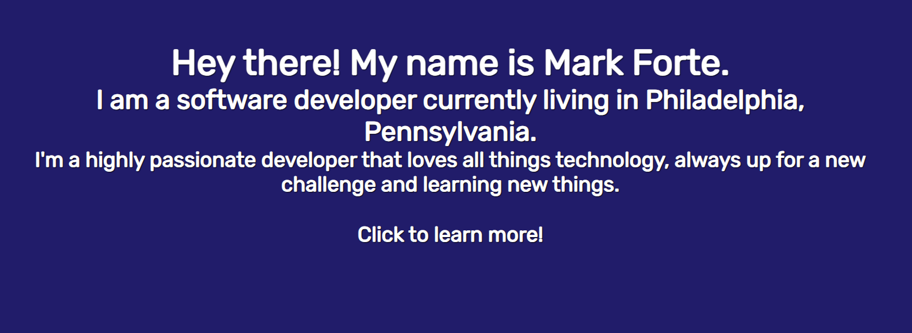

# Forte Portfolio 

## Description

Hey There! Welcome to the Readme for my portfolio. This is a site created with React using Vite! It utilizes a variety of different technologies to deliver a fast and responsive site.

A screenshot of the current site:

## Table of Contents

- [Installation](#installation)
- [Usage](#usage)
- [License](#license)
- [Contributing](#contributing)
- [Tests](#tests)
- [Questions](#questions)

## Installation

The application can be viewed live here on Netlify: https://rad-profiterole-722f7c.netlify.app/, the site is static, so there is no need to login or sign up.

## Usage

The program is indeeded to help a user keep track of their notes. It has the ability to work online and offline. It can work as an installed app or just a web app

A Link to the GitHub Repo: https://github.com/mforte215/forte-portfolio

A URL to the Deployed Application: https://rad-profiterole-722f7c.netlify.app/

## License

NOTICE: This repository uses the MIT License

## Contributing

Mark Forte

## Tests

N/A

## Questions

GitHub Username: mforte215

Email: markcforte@gmail.com

Additional Contact Information: N/A
